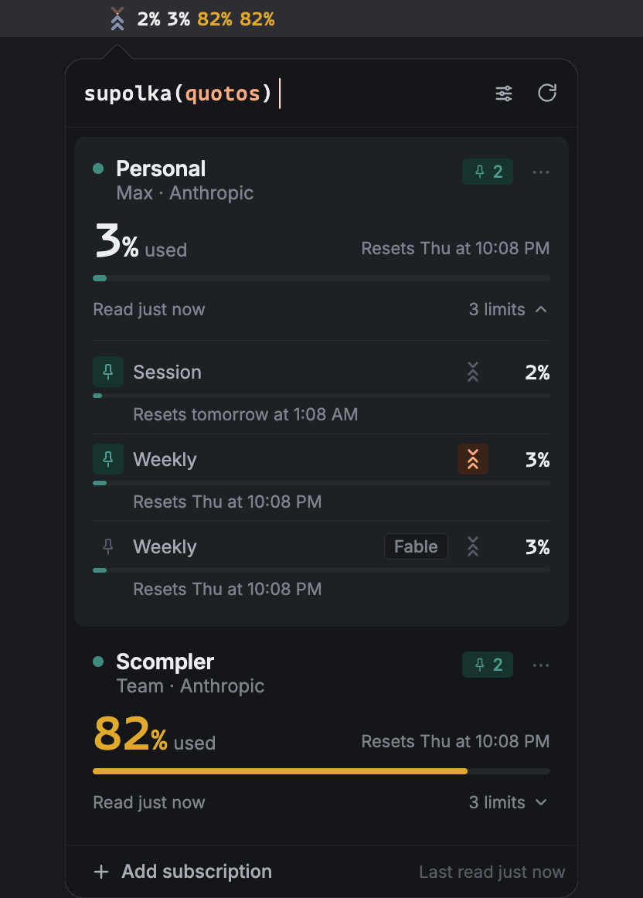

<div align="center">


# Quotos

A macOS menu bar app that shows, at a glance, how much of each Claude
subscription is left.

[](https://github.com/maksimyaromin/quotos/actions/workflows/ci.yml) [](LICENSE) 


</div>

Quotos reads accounts directly from the machine, with no server and no
account of its own. See [the design brief](docs/design/brief.md) for
the full product specification and [the architecture](docs/architecture.md)
for how the application is built.

## Requirements

- macOS 15 or newer. `src-tauri/tauri.conf.json` sets this as the
  build's floor. Below that, the build finishes but the app will not
  launch.
- Node.js 24 or newer, the version `.nvmrc` pins and `package.json`'s
  `engines` field enforces.
- A Rust toolchain, since Tauri builds a native backend alongside the
  web frontend. Rust needs Xcode's command line tools to link on macOS:
  ```bash
  xcode-select --install
  ```
- Claude Code, installed and signed in. Quotos reads Claude Code's own
  configuration directories and Keychain credential; without it there is
  nothing to show.

## Providers

Quotos supports Claude today. It reads every Claude Code account on the
machine: the default `~/.claude` directory and any sibling
`~/.claude-*` directory, so more than one account is picked up
automatically, with nothing to configure. The provider layer underneath
is built to take more than Claude; nothing above it assumes there is
only one.

## Install

1. Clone this repository and open a terminal in it.
2. Install dependencies:
   ```bash
   npm install
   ```
   Do this before opening the project in an editor too. Every
   TypeScript project here resolves its own types from `node_modules`,
   and skipping it shows up as editor errors that clear once you run
   it.
3. Build the app and put it in `/Applications`:
   ```bash
   npm run app:install
   ```
   This builds the native bundle with `npm run tauri build`, then
   copies it from `src-tauri/target/release/bundle/macos/Quotos.app`
   into `/Applications`.
4. Launch it:
   ```bash
   open /Applications/Quotos.app
   ```

Quotos appears in the menu bar as a single status item:


Click it to open the panel; it starts empty, with an "Add subscription"
button that lists every Claude Code account Quotos found on the Mac.

If the menu bar icon shows no usage, or the "Add subscription" list is
empty, Claude Code is not installed or not signed in on this Mac.
Install it, sign in, then reopen the panel: Quotos rescans for accounts
each time it opens.

## Live updates from Claude Code

Each tracked account on the Subscriptions screen has an "Enable live
updates" button. Turning it on writes a `statusLine` entry into that
account's `<config dir>/settings.json`, pointing at a small script
Quotos generates at `<config dir's app support directory>/claude-statusline/<slug>.sh`,
and keeps one timestamped backup of the file it changed. If the account
already ran its own status line, the new script wraps it: your line
keeps working, with Quotos listening in front of it. Configuring any
status line makes Claude Code hide most of its footer keyboard hints
(`esc to interrupt`, `? for shortcuts`) for the rest of the session,
which is Claude Code's own behavior, not something Quotos can turn off.

Turning the button off restores the exact previous `statusLine` value
(or removes the key if there wasn't one) and deletes everything Quotos
wrote for that account. To undo it by hand instead, run `/statusline
remove` inside Claude Code, or delete the `statusLine` key from
`settings.json` yourself.

## Run

```bash
npm run tauri dev
```

This runs the real application without building a bundle: a status item
in the menu bar that opens a panel on click.

To exercise every interface state without the native shell, against
mock data, in any browser:

```bash
npm run dev
```

Then open http://localhost:1420/.

## Test

```bash
npm test                       # vitest
npm run typecheck              # TypeScript
(cd src-tauri && cargo test)   # Rust
```

## Verify

```bash
npm run verify
```

The single quality gate: formatting and linting, both TypeScript
projects, the test suite, a handful of repository checks, and the Rust
equivalents. [docs/contributing.md](docs/contributing.md) covers what
each lane checks and where the rest of the documentation lives.

## Contributing

[CONTRIBUTING.md](CONTRIBUTING.md) covers setup, the gate a change has
to pass, and what to expect after opening a pull request. Found a
security issue instead? See [SECURITY.md](SECURITY.md).

## License

[MIT](LICENSE) for the application. The bundled Inter typeface is
licensed separately under the [SIL Open Font License, Version 1.1](src/design-system/assets/fonts/OFL.txt).
The interface's monospace numerals use MonoLisa, a commercial font whose
license does not allow redistribution, so this repository does not ship
it; a checkout with MonoLisa's own `.woff2` files in place uses it, and
any other checkout falls back to a system monospace font.
