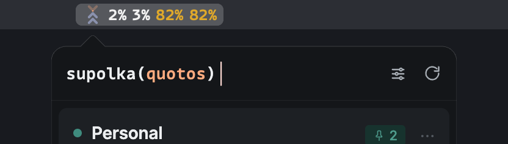

# Architecture

Quotos splits along the Tauri process boundary: Rust owns the operating
system, native windows, the Keychain, and every HTTP request; React owns
what gets drawn. The two sides talk through a small set of
`#[tauri::command]`s and `emit`/`listen` events, never anything wider.
Individual modules carry their own reasoning in their own doc comments;
this page is the map between them.

## Rust backend

| Module | Owns |
| --- | --- |
| `lib.rs` | Application state and the Tauri setup: window and menu events, the tray click handler, wiring every command. |
| `shell.rs` | The interactive shell: the status item's repaint pipeline and the panel's show, hide, dock, detach, and drag lifecycle. See [panel-lifecycle.md](panel-lifecycle.md). |
| `geometry.rs` | Pure placement math and read-only screen queries. No module here moves a window; `shell.rs` does that with these numbers. |
| `panel_window.rs` | Turns the panel into a non-activating `NSPanel`, the AppKit window class that can hold keyboard focus without activating its application. |
| `status_item_render.rs` | Composites the status item's glyph and colored percentage digits into an RGBA bitmap, since `tray-icon` has no colored-title path. See [status-item-rendering.md](status-item-rendering.md). |
| `accounts.rs` | The account-data plane: discovery, the one real fetch path, the native refresh scheduler and its idle/lock pause, and the IPC commands for the tracked list, statusline integration, and sign-in. |
| `idle.rs` | Read-only queries for system idle time and screen-lock state, and the pure decision of whether automatic reads should pause. |
| `scheduler.rs` | The native one-read-per-account-per-minute timer. |
| `persistence.rs` / `atomic_write.rs` | The tracked-subscriptions list and the pin groups as one durable JSON file, and the fsync-then-rename write helper it shares with `statusline.rs`. |
| `providers/mod.rs` | The provider trait and the typed `FetchError` every provider returns on failure. |
| `providers/claude.rs` | The Claude Code adapter: Keychain reads, the usage and profile HTTP calls, credential renewal. |
| `signin.rs` | Drives Claude Code's own `claude setup-token` login over a pty. Quotos never touches or writes a credential itself. |
| `statusline.rs` | Installs and reads the opt-in Claude Code statusline feed, a second, zero-cost usage source. |
| `single_instance.rs` | The OS file lock that keeps one Quotos running per machine, since two live instances would double the polling against the provider's own limit. |
| `launch_at_login.rs` | The Launch at Login toggle, through `SMAppService`. Quotos stores nothing; the OS is the single owner of this state. |

### Module file names

Rust derives a module's identifier from its file name, and a Rust
identifier cannot contain a hyphen, so a kebab-case file such as
`atomic-write.rs` can only back the `atomic_write` module through a
`#[path = "atomic-write.rs"] mod atomic_write;` declaration. Every module
in this crate would need one, since every multi-word module here is
snake_case: `atomic_write`, `launch_at_login`, `panel_window`,
`single_instance`, `status_item_render`, plus the single-word modules
that already read as kebab-case by coincidence. That `#[path]` line
would then sit on every `mod` declaration in `lib.rs`, permanently
diverging the file name from the module identifier every reader, every
`rustfmt` run, and every `rust-analyzer` jump-to-definition would show
them by, in exchange for no readability gain: a Rust file's own name is
never read as a URL slug or a cross-language import path the way a
TypeScript module's is. `snake_case` file names matching their module
identifiers is also the convention the Rust ecosystem itself uses
throughout the standard library and crates.io, the same kind of
established, tool-recognized spelling this repository already keeps for
`README.md`. This crate's source files stay `snake_case`.

## React frontend

| Module | Owns |
| --- | --- |
| `app.tsx` | Composes the panel shell, the subscription rows, and the Subscriptions screen. |
| `hooks/use-subscriptions.ts` | The state machine: tracked-subscription membership, refresh, the rate-limit interception rule, persistence, and status item segment derivation. |
| `providers/registry.ts` | The frontend half of the provider seam: dispatches normalization and outcome mapping to the right provider by its slug. |
| `providers/claude/` | The Claude adapter: usage and profile normalization, headline selection, outcome-to-state mapping, statusline reconciliation. |
| `lib/persistence.ts` | The frontend seam to the tracked list and the pin groups: the native IPC commands on a real build, `localStorage` as a fallback in the browser harness. |
| `lib/tauri-client.ts` | Swaps between the real Tauri IPC client and a mock client based on whether `__TAURI_INTERNALS__` exists, so every UI state stays reviewable from a plain browser. |
| `hooks/use-pin-groups.ts` | Pin group membership, naming, ordering, and each group's rolled-up-or-opened state in the menu bar, with its own persistence. |
| `lib/pin-groups.ts` | The composite member key, a group's derived slug, and how pinned windows resolve into groups and standalone pins. |
| `lib/customize-drag.ts` | What a drag on the customize screen means: the library reports what the pointer is over, this says what dropping there would do. |
| `components/customize-display-screen.tsx` | The screen groups are arranged on, built on `@dnd-kit`. See [customize-display.md](customize-display.md). |
| `lib/row-presentation.ts` | What a row shows besides its numbers: the badge, the one action offered, and the footer note. |
| `lib/status-item-segments.ts` | Turns tracked subscriptions and pin groups into the status item's digit segments, tooltip, and worst-active-limit percentage. |
| `types/entities.ts` | The provider-agnostic entities. Nothing above its own dividing line, and nothing that renders UI, references a specific provider by name. |
| `src/design-system/` | The component library the app builds against. See its own `index.ts` barrel and [contributing.md](contributing.md) for the module-layout rule that keeps consumers on it. |

## The provider seam

Adding a provider is a new module on each side plus one entry in
`providers/mod.rs` and `providers/registry.ts`. Nothing else references
a provider by name: not the panel, not the hooks, not the state
machine.

Two things stay provider-owned rather than living in the generic shell,
because they are genuinely provider-specific policy:

- **Headline selection.** `normalize-usage.ts`'s `pickAccountWideWeekly`
  picks the account-wide weekly window as the headline number, never
  simply the most-consumed window, so a heavily used per-model window
  can't outrank the real account total.
- **Outcome mapping.** `providers/claude/index.ts`'s `mapOutcome`, called
  through `registry.ts`'s `mapOutcomeFor`, turns a read outcome into a
  `SubscriptionState` and a reason string. The generic hook only ever
  supplies the outcome and whether a prior good read existed.

`rate_limited` is deliberately outside this mapping. See State model
below.

## From a read to a rendered row

1. A read starts from `scheduler.rs`'s native timer or a manual action;
   both call the same `fetch_snapshot` command, so a manual refresh resets
   the scheduled minute for free.
2. `fetch_snapshot` calls the provider directly and returns a normalized
   snapshot or a typed `FetchError` over IPC, never a stale number as if
   it were current.
3. `use-subscriptions.ts` applies the result the same way whether it
   arrived from a direct call or from the scheduler's `quota-refresh`
   push event, through `applyRefreshResult`.
4. The same state feeds three places at once: the panel row, the
   persisted tracked list, and the status item's digits.

## State model

- **Percent fields mean consumed, not remaining**, across
  `Subscription.used`, `LimitWindowEntity.used`, and
  `NormalizedUsage.used`.
- **`severity`** is computed from every window a subscription has, not
  just its headline one: `critical` when any window is at least 90%
  used, `warn` at 75%. A subscription with a low headline percentage can
  still read amber, because color comes from `severity`, not from the
  headline number's own size.
- **`idle` and "no limits reported yet" are different states.** `idle`
  means the subscription has never been read successfully. `state:
  "working"` with `used: null` means a good read that had nothing to
  report. `lib/row-presentation.ts` shows `reason ?? "No limits reported
  yet."` for every state without a number.
- **Health and a pending rate-limit wait are separate fields on
  purpose.** A wait the provider itself imposed via a 429 must never
  overwrite a real diagnosis. `use-subscriptions.ts` intercepts a
  `rate_limited` outcome before it reaches a provider's outcome mapper
  and restores the state and reason captured before the attempt started,
  except when that captured state was itself in flight, in which case it
  settles to `working` or `idle` instead of being written back verbatim
  as "reading forever."
- **A manual refresh or the panel opening is never skipped client-side
  for a pending wait.** Only the native scheduler's own automatic cadence
  honors it; a manual attempt always reaches the provider, so a wrong
  diagnosis is never impossible to retest.
- **`FetchError` distinguishes `Unauthorized`, meaning the sign-in itself
  ended, from `CredentialStale`, meaning the access token merely aged
  out and is still renewable.** Conflating the two reports a working
  account as needing to sign in again. See
  [claude-provider.md](claude-provider.md) for the renewal mechanics
  that produce this distinction.

## Persistence

`persistence.rs` writes the tracked list, membership, custom names, and
pins, as a plain JSON file rather than trusting the webview's
`localStorage`, through `atomic_write.rs`'s temp-file-then-rename helper.
`lib/persistence.ts` wraps the same data on the frontend: the native
`load_tracked` / `save_tracked` commands on a real build, `localStorage`
in the browser harness, which has no Rust side to call.

A file that fails to parse is moved aside to `tracked.json.corrupt`
first, best effort, since `Store::load` starting empty never depends on
the move succeeding; leaving the unread bytes in place would let the
very next save destroy the only copy of whatever the file held. The
backup keeps exactly one slot, so a second corruption overwrites the
first. `save_tracked` is an async command the frontend fires on every
membership, label, or pin change, so two saves can overlap; `Store::save`
holds its mutex across the whole write, disk and memory updating
together, since a writer that renamed its file last but locked the
mutex first would leave disk and memory telling different stories, and
the scheduler polls from memory while the next launch loads from disk.
The save runs on a blocking thread, never across an `await`, so holding
the lock through file I/O blocks only sibling saves.

A failed save logs on the Rust side, since a rejected `invoke` promise
alone leaves no trace a release build's console can show. The frontend's
save effect in `use-subscriptions.ts` exposes the same failure as
`saveError`, so it is detectable as state rather than only as a passing
console message, and clears its save-dedupe record so the very next
change retries instead of the failure going silent.

A `localStorage` write returns as soon as the in-memory page state
updates, and WebKit flushes its backing store to disk on its own
schedule; whether an abrupt quit can race that flush was never
conclusively pinned down, so the Rust side owns the durable copy instead,
synchronously `fsync`'d before `save` returns. A plain JSON file rather
than SQLite for the same reason as every data store this small in the
app: a handful of accounts is simpler to read, review, and hand-edit as a
file than as a database, and a file serves every query pattern this data
needs.

`lib/persistence.ts`'s `migrateFromLocalStorageIfEmpty` is a separate,
one-time migration from a pre-native-store build that only ever kept
`localStorage`'s `quotos.tracked.v1` key: it runs once, only while the
native store reads back genuinely empty, and never again once the
native store holds any data at all, including a state the user reached
by removing every tracked account. It leaves that legacy key untouched
after migrating rather than clearing it, so a build predating the
native store can still recover its list by rolling back to it.

Pinning is per limit window, not per subscription:
`Subscription.pinnedWindowIds` is a persisted set of window ids, since
every window a provider's normalizer builds carries a stable id from
`normalize-usage.ts`'s `windowId(kind, scope)`. `persistence.rs`'s
`TrackedAccount` struct mirrors the wire shape field for field, including
a migration-only `pinned` field present only when a record was loaded
from a file that predates `pinnedWindowIds` and wrote `pinned: true` or
`pinned: false` instead. `use-subscriptions.ts`'s `pendingPinMigrationRef`
reads that field to detect and migrate such a record, and never sends it
back on `save_tracked`, so `skip_serializing_if` sheds it from disk on
the very next save; it appears only on the one load that still has the
old shape to read. Any time an entity's wire shape changes, check
whether this struct still mirrors it, since a mismatched Rust struct
does not error; it silently reshapes the JSON in transit.

## Pin groups

A pin group collects pinned limit windows from any subscription, any
provider, under one name, so the status item can spend one rolled-up
figure on the group rather than one per member. Groups live in a
top-level `groups` array beside `tracked` in the same file, not inside
any `TrackedAccount`, since one group spans several; `PinGroup` is the
shape on both sides, and `#[serde(default)]` is the whole of its
migration story, a file written before groups shipped simply loads with
none. `Store::save` and `Store::save_groups` both rewrite the whole
shape under one mutex, so writing either half never drops the other.

A group names its members by composite key, not by bare window id, since
a window id is only unique within its own subscription.
`lib/pin-groups.ts`'s `pinMemberKey` percent-encodes the subscription id
before joining it to the window id with `::`. Both halves can contain a
colon of their own, a subscription id is `provider:slug` and a window id
can be `kind:scope`, so encoding the left half is what keeps the first
`::` the real boundary and the join reversible.
`layoutPinnedEntries` resolves those keys against the live windows every
render rather than pruning them: a key naming a window the latest read
no longer reports is inert, exactly as a stale `pinnedWindowIds` entry
is, and comes back if the window does.

Membership never survives unpinning, and unpinning is never a side
effect of anything a group does: `app.tsx`'s `unpinWindow` is the one
path that does both.

Pinning is a plain toggle, wherever it is offered: a limit window's own
pin button and the row menu's "Show in menu bar" entry both pin or
unpin and nothing else. Where a pin sits is a separate decision, made
on its own screen, so nobody has to think about grouping at the moment
they pin something.

That screen is `components/customize-display-screen.tsx`, reached from
the panel header and offered only once something is pinned. Every
pinned window is a row: grouped rows boxed under their group's header,
standalone rows loose below them. Dragging one row onto another groups
the two, onto a group's box joins that group, onto a member joins ahead
of that member, and onto the strip that appears at the end of the list
returns a member to standing alone. Dragging a group's header onto
another group's reorders the two. None of it ever unpins anything.

The strip at the top of that screen previews the menu bar from
`use-subscriptions.ts`'s own `statusItemSegments`, the very list
`set_status_item_state` is called with, not a second derivation of it,
so the preview cannot drift from what the status item draws.

A group's `color`, one of `lib/pin-groups.ts`'s fixed palette names, is
persisted with it rather than derived from its position, so the colour
is a stable identity: `status_item_render.rs` draws it as a bar under
every figure the group owns, and `tokens/colors.css` carries the same
names for the panel's own swatches. A new group takes the first palette
colour no group is wearing. A group loaded from a file written before
colours shipped is assigned one in `lib/persistence.ts`, so every
reader downstream can count on there being one.

`collapsed` is that group's state in the menu bar: rolled up to one
figure, or opened out so every member shows its own. It is persisted in
the group's own record rather than held in memory, so the arrangement
survives a restart, and it is per group, so several can stand open at
once. A new group starts rolled up, since spending less menu bar width
is the reason to make one.

## Clicking a group's slug in the menu bar

A left click on a pin group's slug belongs to that group: it toggles
`collapsed` in place, with no panel involved. A click anywhere else on
the status item, a bare figure included, opens the panel exactly as it
always did. The figure reports a number; the slug is the button.

Telling the two apart needs the click's position inside the composited
image. `TrayIconEvent::Click` carries both `position`, the click point,
and `rect`, the item's own box, both converted by `tray-icon`'s macOS
backend with the same window backing scale factor, so they share units
and their difference is the click's offset across the button.

That offset is not the offset into the image. The button is wider than
the image it centres, by the same system margin the beak's own
positioning has to account for, so treating the click as a bare
fraction of the button's width and scaling it back out by the image's
width stretches and shifts it: at the measured eight points per side
the error reaches about sixteen pixels at either end of the image, more
than a slug is wide, which is what made a click on a group open the
panel some of the time and fold the group the rest. `group_at_click`
takes both into points on the item's own display and calls
`geometry.rs`'s `click_x_in_icon_px`, which subtracts the margin derived
from the two widths — the same derivation
`glyph_center_offset_from_item_left_points` uses — and scales into the
image's own pixels.

`shell.rs` caches each slug's rendered pixel span in
`last_status_item_slug_spans` on every repaint, beside the segments
themselves, and looks that pixel up; see "Resolving a click back to a
slug" in
[status-item-rendering.md](status-item-rendering.md#resolving-a-click-back-to-a-slug)
for how those spans are derived and padded.

Which figure carries a group's slug is the frontend's business, not the
native side's: `StatusItemSegment.groupId` rides along with each
segment, and `slug` is set on the figure leading that group's cluster,
rolled up or opened out. When a click does resolve to a slug, the native
side emits `status-item-group-clicked` with the id and does nothing
else; `use-pin-groups.ts` flips that group's flag, and the segment list
is rebuilt and pushed back down through the same `set_status_item_state`
path as any other change.

### The view that catches those clicks

`tray-icon` catches clicks with a view of its own, added over the status
item's button, and re-fits that view to the button only while setting an
icon. Quotos sets the item's length after the icon, from
`sync_status_item_length`, so every repaint that widened the item left a
strip of bare `NSStatusBarButton` on the right that the crate's view no
longer covered: clicks there never reached `on_tray_icon_event` at all,
and AppKit, which pops an `NSStatusItem`'s own `menu` on any click that
reaches the button, showed the Launch at Login / Quit menu on a plain
left click. `sync_status_item_length` now re-fits that view itself,
after the length it just set, so the whole item is Quotos's to interpret
however many figures it grew by.

The menu is Quotos's to show for the same reason. Nothing is attached to
the item at rest: `tray_click_intent` reads the button and its state
from the click event, `show_status_item_menu` attaches the menu, shows
it, and detaches it again once its own tracking loop returns. Whether
the menu appears is then decided by the same event every other click is
decided by, rather than by AppKit finding a menu hanging off the item.

## Refresh scheduling and pausing when nobody is looking

`scheduler.rs` runs natively rather than as a JavaScript interval,
because macOS suspends timers in a hidden or occluded `WKWebView`: a
measured 8-second `setInterval` produced zero ticks over 150 seconds
while the window stayed hidden and the process itself stayed alive and
idle. An OS-level timer has no notion of "hidden" at all.

No request is ever refused by Quotos itself; the provider is the only
thing that says no. Opening the panel and pressing its manual refresh
both fire a real HTTP request for every tracked account, through
`use-subscriptions.ts`'s `refreshAll`, regardless of any pending wait.
Only `scheduler.rs`'s own automatic cadence ever holds back.

Each account is due for an automatic read once a minute, anchored to
its last attempt rather than a free-running timer: `mark_attempted`
anchors the next automatic read 60 seconds out from whenever the
attempt actually happened, whether that attempt came from the
scheduler's own periodic pass or a manual read, so a manual refresh
resets the minute for free with nothing extra to wire up. A rate-limited
`retry_after` is honored exactly for that next automatic read, floored
at one minute when the provider's own header asks for less, since
retrying an automatic read earlier would only draw a guaranteed second
429. A manual read during that wait still reaches the provider; if it
draws its own 429, `mark_attempted` re-anchors the wait from that fresh
header rather than extending the first one.

Two independent entrants can call the scheduler's due-pass: its own
periodic loop and the frontend's launch-time kick. An account is only
marked attempted after its fetch completes, and a fetch may first run a
bounded credential renewal ahead of the ordinary token expiry, so the
kicked pass can still be mid-fetch when the loop's own tick arrives.
Without a gate, both entrants would see the same account as due and
fetch it twice at the same instant; `begin_pass` lets only one entrant
run at a time and the loser skips outright, since whatever is due is
already the running pass's job and anything that becomes due later is
at most one tick away.

`spawn_scheduler`'s native timer ticks every 5 seconds, cheap since each
tick is just a due-time comparison per tracked account with no network
call unless something is actually due, and runs for the app's lifetime
regardless of panel visibility. Its first periodic tick is deliberately
delayed by those same 5 seconds rather than firing immediately: every
tracked account is due the moment the app starts, and an immediate tick
could fire and emit before the frontend has mounted and subscribed to
`quota-refresh`, silently losing that first read, since events are not
queued for late subscribers. `kick_scheduler`, called once the frontend
has actually subscribed, covers the real read-at-launch case; the
loop's own first tick is only a safety net for if that kick is somehow
skipped, and both go through the same `is_due` and `mark_attempted`
bookkeeping, so whichever reaches a given account first makes the other
a no-op rather than a second scheduler.

Every automatic pass also asks `idle.rs` whether anyone is actually
watching: `system_idle_seconds` reads macOS's own idle timer, and
`watch_screen_lock_state` keeps a flag current from the
`com.apple.screenIsLocked` / `com.apple.screenIsUnlocked` distributed
notifications, registered once at startup and never unregistered for
the life of the process. Ten minutes idle or a locked screen skips every
account's automatic read outright, without even touching `is_due`; a
manual refresh or the panel opening ignores this pause entirely, since
those are real requests, not a scheduled poll. `Scheduler::observe_pause`
records the pass's decision and reports the one pass where it flips from
paused back to active; that pass calls `wake_all` to clear every tracked
account's anchored due time, so the very next tick reads everything
immediately instead of waiting out whatever was left of each account's
own minute.

Because reads are unattended, `single_instance.rs` keeps exactly one
Quotos running per machine with an OS file lock: two live instances
would each poll on their own one-minute cadence, doubling the request
rate against the provider's own limit for no benefit. Double-clicking
the bundle never produces two instances, since Launch Services activates
the running copy instead; a dev run alongside an installed build, or a
duplicated `.app`, does, since both share one bundle identifier and
therefore one config dir, where the lock file lives. `File::try_lock`
calls `flock`, which the kernel releases whenever the owning process
exits, so there is no stale lock file to detect or repair and no pid to
misread after reuse, unlike a pid file; the standard library has had
file locking since Rust 1.89, so a dedicated single-instance plugin,
built around forwarding argv to a window to focus, would be a dependency
pulled in for one syscall this windowless app has no use for.

Every path that reads an account, a header refresh, a row's manual
refresh, a launch read, or a newly added subscription's first read,
funnels through `use-subscriptions.ts`'s `refreshOneGuarded`, the one
per-account in-flight guard, so a concurrent request joins the in-flight
read instead of firing a second one for the same account at the same
instant.

## Coordinate spaces and panel placement

No single "physical pixel" coordinate space exists across the APIs this
app depends on: a tray click's rect, a monitor's position, and a
window's own position each carry a different display's scale factor.
`geometry.rs`'s `DisplayPoints` documents the full conversion table and
converts everything to points at the edges; nothing else in the codebase
stores or compares a physical value. `shell.rs` computes the panel's
position itself from the tray icon's rect, handed fresh on every click,
rather than through any positioning plugin.

macOS has exactly one coordinate space in which a multi-display layout
has a single, consistent meaning: global points (`CGDisplayBounds` /
`NSScreen.frame`), top-left origin at the main display's top-left. There
is no global pixel space; "physical pixels" are only ever defined
relative to one display's own backing scale factor. The three APIs
`geometry.rs` depends on each hand out a `Physical*` type that is really
"global points times some display's scale factor", and they disagree on
which display's: `TrayIconEvent`'s `rect` uses the menu bar display's
own scale factor, `tao`'s `Monitor::position()`/`size()` use that
monitor's own scale factor, and `set_position(Physical)` /
`WindowEvent::Moved` use the window's current scale factor. On a
single-display machine all three coincide; on displays at different
scale factors they diverge, so `resolve_status_item_point` tries each
display's own scale factor against the status item's rect and keeps the
one whose quotient actually lands inside that display, tie-breaking on
whichever candidate sits closest to its own display's top edge, since a
menu bar always hugs it. On the way out, `apply_docked_position` places
the window with a `LogicalPosition`, which `tao`'s `Position::to_logical`
passes through untouched, so no scale factor is consulted there either;
a `PhysicalPosition` would be reinterpreted through whatever display the
window happens to currently sit on.

`displays_in_points` reads `NSScreen` directly on macOS rather than
going through `tao`'s `Monitor`, since it is the only API that also
reports `visibleFrame`, where the menu bar height comes from; it falls
back to `tao`'s monitor list anywhere else, losing only that height.
AppKit's global space is y-up from the first screen's bottom-left,
while the rest of `geometry.rs` is y-down from its top-left, so the
first screen's own height is the flip constant, its origin being
`(0,0)` by definition. `visibleFrame` also excludes the Dock, but the
Dock never sits at the top, so the difference at the top edge is the
menu bar and nothing else; that height must never be hardcoded, since a
notched built-in display's menu bar is noticeably taller than an
unnotched external display's.

The status item glyph's own center, as an offset from the item's left
edge, is not the whole button's center: `NSStatusItem` centers the
whole composited image inside a button wider than the image by a system
margin that grows once pinned digits widen the image.
`glyph_center_offset_from_item_left_points` derives that margin fresh
from the item's current width and the composited image's own known
width, and falls back to treating the glyph as flush with the item's
left edge if the item's width is unavailable, a plausible worst case
rather than a crash.

The header's `startDragging()` call fires synchronously on `mousedown`,
not after the first `mousemove`, since AppKit's window-drag API uses
whatever the current event is at the moment Rust actually runs it.
Relocating the window's frame while a mouse button is held over it
reactivates the app regardless of which API moves it; Quotos accepts
that as the cost of a working drag rather than fighting it.

## The beak

The panel's beak is one shape with the panel itself, not a second
layer, drawn from a single outline path so no two translucent layers
overlap and double their alpha at the seam. Its size and position live
in three files with nothing syncing them automatically: `geometry.rs`'s
`docked_layout_in_points`, `panel.tsx`'s matching constants, and
`app.css`'s panel padding. The beak's center stays on the status item
glyph's own center; the layout solves for the beak's tip, not the
panel's top edge.

`docked_layout_in_points` derives the window's x from where the beak
wants to sit rather than positioning the panel first and fitting the
beak to it afterward: the beak's center must stay exactly on the
glyph's center, so moving the beak away from the panel's corner can
only be done by moving the whole panel left, and deriving x from the
beak's wanted position makes both hold by construction at whatever
glyph offset the status item reports. The panel is inset inside its own
window, which is deliberately wider and taller at the top, for the drop
shadow's blur to fade into rather than be clipped by, and for headroom
above the beak; both insets live in `app.css` and are load-bearing here
because the window is what gets positioned while the panel is what is
actually visible. The x candidate is clamped to the display before the
beak offset is recomputed from the clamped x, not the wanted one, so a
screen-edge clamp moves the beak across the panel instead of dragging
it off the glyph; the clamp only keeps the notch on the panel, since
`buildPanelOutlinePath` shrinks whichever top corner the notch
encroaches on rather than letting the notch move off the glyph.

`panel.tsx`'s `BEAK_BASE_HALF`, `BEAK_HEIGHT`, and `NOTCH_RESERVE` are
the frontend half of that same three-file sync: `BEAK_BASE_HALF * 2`
must equal `geometry.rs`'s `BEAK_BASE_WIDTH`, `BEAK_HEIGHT` is what that
function subtracts to put the beak's tip just under the menu bar rather
than the panel's own top edge, and `NOTCH_RESERVE` must be at least
`BEAK_HEIGHT` plus half the outline's 0.5px stroke width while also
equaling `app.css`'s `padding-top`, so the beak stays inside the
transparent window instead of being clipped by its edge.

`tokens/elevation.css`'s `--shadow-popover` blur radius has to stay
within the transparent window's own 14px margin around the panel, the
same margin `app.css`'s `padding-top` and this section's panel insets
both draw on. A wider blur hard-clips against the window's edge instead
of fading out, reading as a dark halo band against a bright desktop
rather than a soft shadow.

The window's y solves for where the beak's tip should land: the tip
sits a fixed clearance below the menu bar's bottom edge, read live from
`NSScreen.visibleFrame` rather than a constant, since the notched
built-in's menu bar is noticeably taller than an external display's.
Inside a full-screen Space the menu bar is auto-hidden and
`visibleFrame` reports no bar height even while the bar sits revealed
under the cursor, so the fallback reconstructs the bar's bottom from
the status item itself: macOS centers a status item vertically in its
bar, so the bar's bottom is the item's own bottom plus the same inset
that sits above it.
